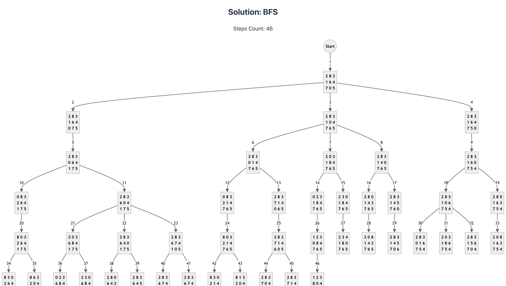

# Eight Puzzle Problem in Vue 3

## Demo

[](https://asherjingkongchen.github.io/eight-puzzle-problem/)

## Development

To start up the project, run the following commands:

```shell
npm install
npm run dev
```

Then, the solutions will be available at [`http://localhost:5173/`](http://localhost:5173/).

Open the solution web page in your browser and you will see the following diagrams:


